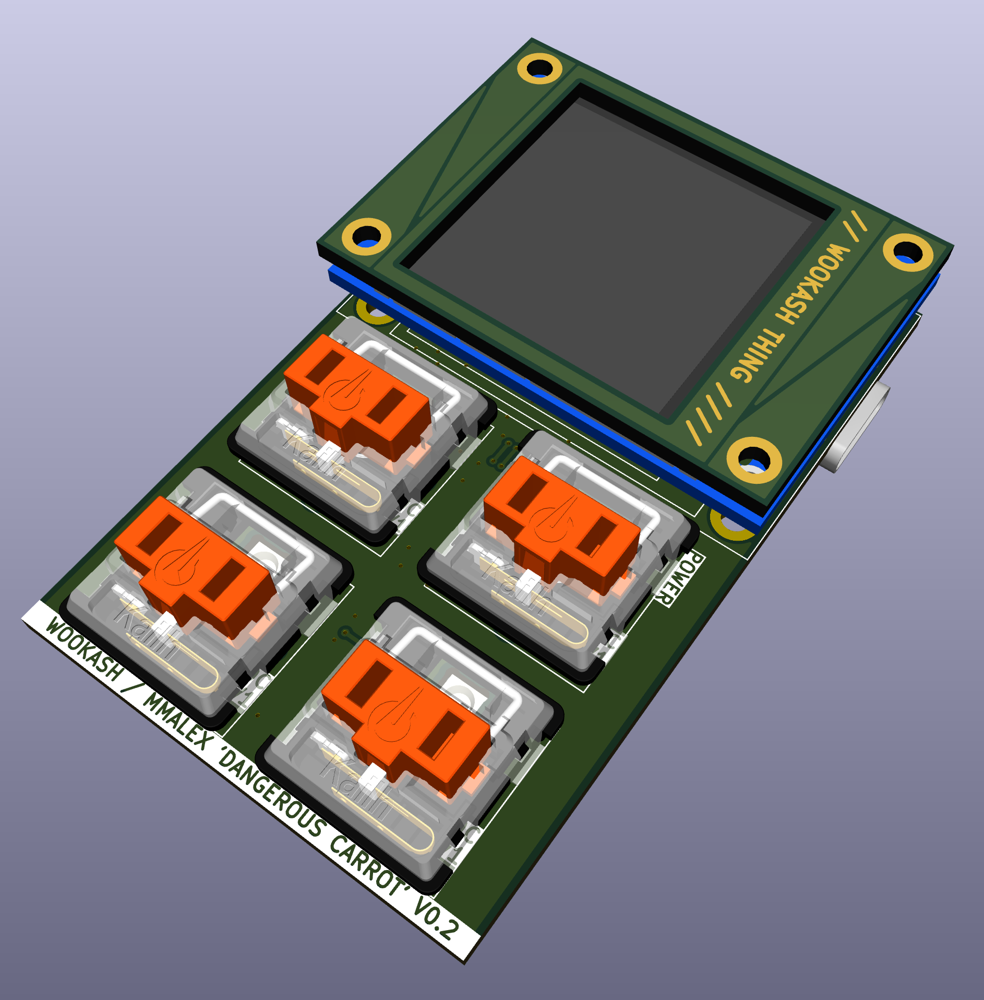
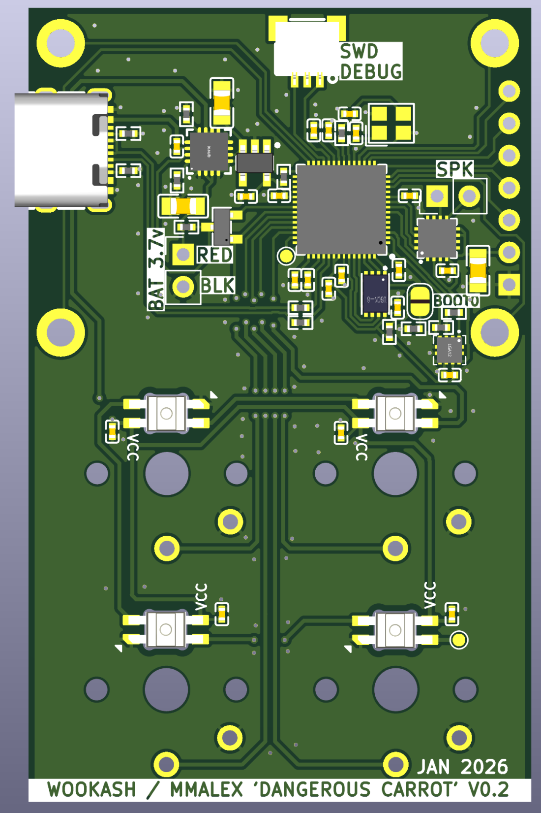
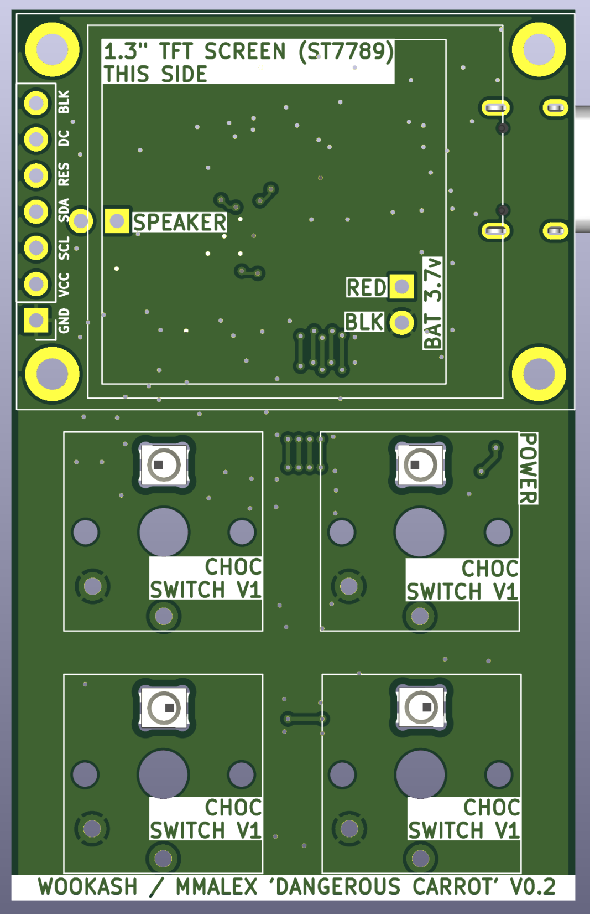
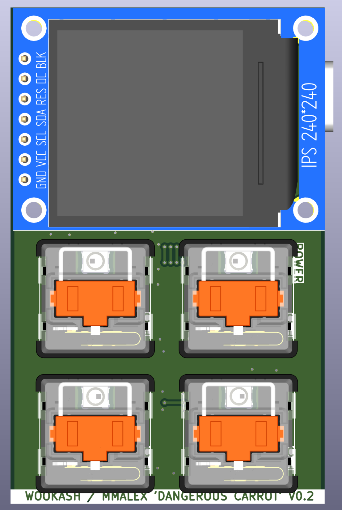

from a livestream with wookash on Friday 2026-01-16

(youtube link forthcoming)

small Raspberry Pi RP2040 'demo' project, with 4 choc-switch buttons, rgb leds, a TFT screen, captouch around the bezel, an SWD programming header, lipo battery connection, and speaker connections.

Mostly untested - planning to order shortly to see if it works.

  
  
  
  

See [notes.txt](notes.txt) for JLC part numbers used during the stream, and a few links.

* keyboard lib - https://github.com/ebastler/marbastlib
* easyeda2kicad - https://github.com/uPesy/easyeda2kicad.py
* jlc part search - https://yaqwsx.github.io/jlcparts/#/
* keyswitch 3d models https://github.com/koktoh/keyswitch_model.git
 
  
